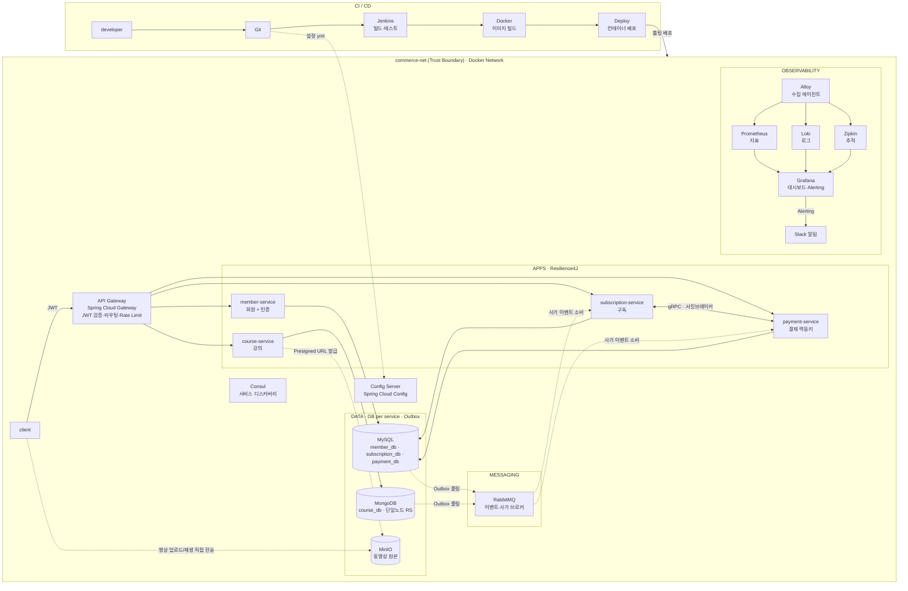
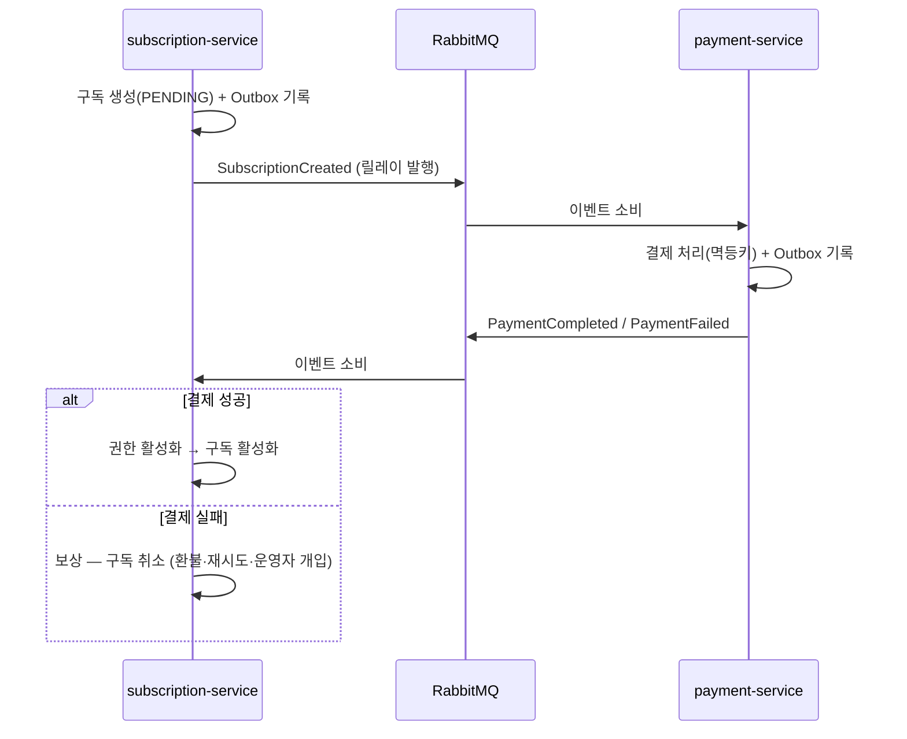

# LXP MSA Architecture

> 구현 스택 기준 목표 아키텍처. 확정 배경은 [DECISIONS.md](DECISIONS.md), 폴더 구조는 [PROJECT_STRUCTURE.md](PROJECT_STRUCTURE.md) 참고.

## 전체 구조

## 흐름 유형

| 흐름 | 경로 |
|---|---|
| 사용자 요청 | client → Gateway(JWT 검증) → 각 서비스 |
| DB 접근 | 서비스 → 자기 스키마/DB만 (타 서비스 스키마 접근 금지) |
| 이벤트·메시지 | 서비스 → Outbox 테이블 → 내부 릴레이 폴링 → RabbitMQ → 소비 서비스 |
| 동영상 | client ↔ MinIO 직접 전송 (Presigned URL), course-service는 메타데이터·URL만 관리 |
| 서비스 간 동기 호출 | gRPC + Resilience4J 서킷브레이커 (subscription ↔ payment) |
| 관측 | 서비스 → OTLP push → Alloy → Prometheus/Loki/Zipkin → Grafana → Slack |
| 설정 | config-repo(Git) → Config Server → 각 서비스 |

## 구독 결제 사가 (코레오그래피)

- 보상(실패 시): 구독 취소 / 환불 / 재시도(멱등) / 운영자 개입
- 오케스트레이터 없음 — 각 서비스가 이벤트를 구독해 스스로 다음 상태를 결정

## Outbox 패턴

각 서비스는 도메인 변경과 이벤트 기록을 **하나의 로컬 트랜잭션**으로 커밋한다.

1. 비즈니스 테이블 변경 + `outbox` 테이블 INSERT (동일 트랜잭션)
2. 서비스 내부 `@Scheduled` 릴레이가 outbox 폴링
3. RabbitMQ 발행 + confirm 수신 후 발행 완료 마킹

별도 릴레이 서비스를 두지 않는 이유: 외부 릴레이는 모든 서비스 DB에 접근해야 하므로 DB per service 경계를 깨뜨림 ([DECISIONS.md](DECISIONS.md) 참고).

## 적용 원칙

- 모든 도메인 서비스는 Gateway를 단일 진입점으로 두고 경로 기반으로 라우팅한다.
- 각 서비스는 독립 Spring Boot 프로젝트이며, 하나의 모노레포 안에서 서비스별 하위 프로젝트로 관리한다.
- config-server, Consul 등 공통 인프라는 Gateway에 노출하지 않고 서비스가 직접 사용한다.
- 설정은 코드가 아닌 데이터로 취급하여 루트 `config-repo`에서 중앙 관리한다.
- DB per service는 개발 단계에서 **스키마 단위**로 지킨다(물리 분리는 운영 확장 시).
- 인증(JWT 발급)은 member-service가 담당하고, Gateway는 검증만 한다.

## 가용성 로드맵

개발(1주 구현)은 단일 노드로 단순화하고, 운영 확장 시 아래를 적용한다.

| 구성요소 | 개발 | 운영 확장 |
|---|---|---|
| RabbitMQ | 1노드 | ×3 Quorum Queue (브로커 SPOF 제거) |
| MongoDB | 단일노드 ReplicaSet (트랜잭션 가능) | ReplicaSet ×3 |
| Consul | 1노드 (`bootstrap-expect=1`) | 3노드 |
| MySQL | 단일 컨테이너 · 스키마 분리 | 서비스별 인스턴스 분리 |
| Chaos Monkey | 미적용 | 무작위 장애 주입(회복탄력성 테스트) |
