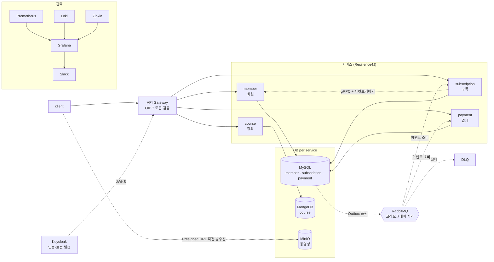

# LXP MSA 인프라 구축 — 프로젝트 보고서

> 모놀리식 LXP(학습 관리 플랫폼)를 마이크로서비스로 옮기기 전에, **인프라와 서비스 골격을 먼저 실행 가능한 상태로 만드는 것**이 이 프로젝트의 목표입니다.

| 항목 | 값 |
|---|---|
| 저장소 | [LXP-Bimyeongsa/lxp-msa-infrastructure-starter](https://github.com/LXP-Bimyeongsa/lxp-msa-infrastructure-starter) |
| 서비스 | 6개 (gateway, config-server, member, course, subscription, payment) |
| 컨테이너 | 21개 (서비스 6 + 인프라 15) |
| 기록된 설계 결정 | 35건 (D-01 ~ D-35) |
| 미결 항목 | 18건 (P-01 ~ P-18, 이 중 8건 해결) |
| 기술 스택 | Java 17 · Spring Boot 3.5 · Spring Cloud 2025.0 |

---

## 1. 아키텍처



### 요청 흐름

| 흐름 | 경로 |
|---|---|
| 인증 | client → Keycloak(토큰 발급) → Gateway(JWKS 검증) → `X-Member-Id` 주입 + 서비스 토큰 부착 |
| 동기 호출 | subscription → member (gRPC + 서킷브레이커) |
| 비동기 | 서비스 → Outbox → 내부 릴레이 → RabbitMQ → 소비 서비스 |
| 대용량 파일 | client ↔ MinIO **직접** (서비스 JVM 미경유) |

---

## 2. 구현한 것

### 2-1. 인증 — Keycloak(OIDC)

자체 JWT 발급으로 시작했다가 **Keycloak으로 이관**했습니다. 비밀번호 재설정·MFA·소셜 로그인을 직접 만들지 않기 위함입니다.

- **자격증명**은 Keycloak, **도메인 프로필**은 member_db가 소유
- 가입 시 두 시스템에 함께 생성하고, 실패하면 보상 처리
- Gateway가 JWKS로 서명 검증 → `X-Member-Id` 헤더로 다운스트림 전달
- 클라이언트가 보낸 `X-Member-Id`는 **모든 경로에서 제거** (위장 차단)

**서비스 간 호출 검증 (D-33)** — 다운스트림은 gateway가 붙인 서비스 토큰을 요구합니다. 그 전에는 `X-Member-Id` 헤더를 무조건 신뢰해서, 네트워크에 닿으면 gateway를 건너뛸 수 있었습니다.

서명 검증만으로는 부족합니다 — **사용자 토큰도 같은 realm이 서명**하므로 서명은 통과합니다. 그래서 `aud: lxp-internal`까지 확인합니다. 이 audience를 실을 수 있는 클라이언트는 gateway 하나뿐입니다.

### 2-2. 구독-결제 사가 (코레오그래피)

```
[성공] 구독 생성(PENDING) → 결제 승인 → ACTIVE
[실패] 구독 생성(PENDING) → 결제 실패 → CANCELLED (보상)
[해지] 해지(CANCELLED) → 환불(REFUNDED)
```

오케스트레이터 없이 각 서비스가 이벤트를 소비해 스스로 다음 상태를 결정합니다.

**Outbox 패턴** — 도메인 변경과 이벤트 기록을 한 트랜잭션으로 커밋하고, 내부 스케줄러가 폴링해 발행합니다. publisher confirm을 받은 뒤에만 발행 완료로 표시하므로 **at-least-once**이고, 그래서 소비자는 전부 멱등하게 만들었습니다.

### 2-3. 정기 결제

결제 스케줄을 **payment-service가 소유**합니다. subscription이 갖고 있으면 payment가 매 주기 되물어야 해서 동기 호출이 생깁니다.

멱등을 두 층으로 뒀습니다.

| 키 | 막는 것 |
|---|---|
| 이벤트 UUID | 같은 이벤트의 재전송 |
| `(subscriptionId, billingCycle)` | 같은 **회차**의 중복 청구 |

두 번째 덕분에 **스케줄러가 여러 인스턴스로 돌아도 분산 락 없이 정합성이 보장**됩니다.

### 2-4. gRPC + 서킷브레이커

구독 생성 시 회원 활성 여부를 gRPC로 확인하고, 그 호출을 Resilience4J로 감쌌습니다.

- **"회원 없음"과 "서비스 장애"를 구분** — `NOT_FOUND`는 원격이 정상 동작한 결과이므로 서킷 집계에서 제외. 이걸 실패로 세면 잘못된 요청이 몰릴 때 멀쩡한 서비스의 서킷이 열립니다.
- **fail-closed** — 확인 불가 시 503. 통과시키면 유령 구독이 생기고 사가가 결제까지 진행합니다.
- **"자격증명 거절"도 서킷 집계에서 제외** (D-34) — 상대가 요청을 받아 거절했다는 건 상대가 살아 있다는 뜻입니다. 장애로 세면 시크릿이 틀렸을 때 멀쩡한 서비스의 서킷이 열리고 진짜 원인이 묻힙니다. **집계에서 빼는 것과 통과시키는 것은 다릅니다** — 결과는 여전히 fail-closed입니다.

시크릿을 일부러 틀리게 주입해 두 실패를 갈라서 확인했습니다.

| 상황 | HTTP | 서킷 | 로그가 가리키는 곳 |
|---|---|---|---|
| 시크릿 오류 (상대는 멀쩡) | 503 | **closed 유지** | 우리 설정 |
| 진짜 장애 (member 중지) | 503 | **open** | member-service |

### 2-5. 회원탈퇴 사가 (D-30 ~ D-32)

```
탈퇴(WITHDRAWN) → MemberWithdrawn
  → 살아 있는 구독 전부 해지(CANCELLED) → SubscriptionCancelled
    → 환불(REFUNDED) + 예약 결제 취소
```

member가 subscription을 **동기 호출하지 않습니다.** 호출하면 탈퇴가 구독 서비스의 가용성에 묶여, 그쪽이 죽으면 탈퇴 자체가 불가능해집니다.

ACTIVE만이 아니라 **PENDING 구독까지** 해지합니다. 탈퇴 직후 결제가 승인되면 주인 없는 ACTIVE 구독이 남기 때문입니다.

이 시점에 Outbox 코드가 세 번째로 복사될 참이라, 먼저 **`common-outbox` 모듈로 추출**했습니다. 세 구현이 서로 달랐다면 판단이 달랐겠지만, 패키지 선언 한 줄 빼고 완전히 동일했습니다.

탈퇴하면 **Keycloak 계정도 비활성화**합니다. 삭제하지 않는 이유는 `sub`이 사라지면 기존 결제·환불 기록의 주체를 추적할 수 없기 때문입니다.

### 2-6. 동영상 저장 (MinIO)

파일이 서비스 JVM을 통과하지 않습니다. course-service는 **서명된 URL만 발급**하고 클라이언트가 MinIO와 직접 주고받습니다.

- 객체 키는 **서버가 생성** (클라이언트 파일명을 쓰면 경로 조작 위험)
- 업로드 완료를 클라이언트 말만 믿지 않고 **객체 존재를 확인**한 뒤 처리

---

## 3. 실제로 부딪힌 문제와 해결

문서 검토만으로는 나오지 않고 **실행해서야 드러난 것들**입니다.

### ① MinIO Presigned URL — 서명 전 네트워크 호출

**증상** 업로드 URL 발급이 503

**원인** MinIO SDK가 서명 직전에 버킷 리전을 조회하려고 endpoint로 실제 호출을 합니다. presign 클라이언트의 endpoint는 **컨테이너 밖 주소**라 서버 자신은 접속할 수 없습니다.

```
Caused by: java.net.ConnectException: Failed to connect to localhost/[::1]:9000
```

**해결** `.region()`을 명시해 조회 호출 자체를 제거

**부수 발견** 예외 핸들러가 원인을 삼켜 로그가 비어 있었습니다. 클라이언트에는 감추되 **서버 로그에는 남겨야** 추적이 됩니다.

### ② 정기 결제 — 트랜잭션 오염

**증상** 중복 회차 테스트에서 `UnexpectedRollbackException`

**원인** 제약 위반을 트랜잭션 안에서 잡아 무시하면, JPA가 그 트랜잭션을 **rollback-only로 표시**합니다. 예외를 삼킨 뒤 커밋하면 터집니다.

**해결** 선검사로 흔한 중복을 거르고, 진짜 동시 요청은 **예외를 전파해 롤백**시킴

### ③ MongoDB 컨테이너 종료 — 잠재 레이스

**증상** 재기동 시 mongo가 `Exited (1)`, course-service가 무한 대기

**원인** `docker-entrypoint-initdb.d`에서 `rs.initiate()`를 실행하면, 그 시점 mongod는 **로컬 소켓에만 붙어 있어** `mongo:27017`을 자기 자신으로 인식하지 못합니다.

**해결** initdb 마운트 제거, 기동 후 실행되는 `mongo-init` 잡으로 일원화

**주목할 점** 이전 재기동에서는 **우연히 통과**하던 레이스였습니다. 재현되지 않는 실패가 아니라, 조건이 맞으면 항상 나는 버그였습니다.

### ④ Keycloak — 속성이 조용히 사라짐

**증상** 사용자에 `member_id`를 넣었는데 토큰에 클레임이 없음

**원인** Keycloak 24+는 **선언되지 않은 사용자 속성을 조용히 버립니다** (User Profile 기능)

**해결** realm에 declarative user profile로 속성 선언

### ⑤ 테스트가 환경에 의존

**증상** 머지 후 member-service 테스트 7개가 전부 실패 (`BindException`)

**원인** gRPC 서버가 테스트에서도 고정 포트 9092에 바인딩하는데, **컨테이너가 그 포트를 쓰고 있었습니다**

**주목할 점** 앞선 빌드가 통과한 건 그때 포트가 **우연히 비어 있었기 때문**입니다. 테스트가 환경에 의존하고 있었습니다.

### ⑥ Keycloak realm import — 조용히 건너뜀

**증상** `accessTokenLifespan`을 고치고 재기동했는데 값이 그대로

**원인** `--import-realm`은 realm이 이미 있으면 건너뜁니다.

```
Realm 'lxp' already exists. Import skipped
```

**해결** `docker compose down -v`

**주목할 점** MySQL init 스크립트와 **정확히 같은 함정**입니다. 상태를 볼륨에 담는 컨테이너는 전부 이 성질을 갖는데, 각각 처음 만날 때마다 새로 놀라게 됩니다.

### ⑦ "막았다"고 생각한 것이 열려 있었음

탈퇴 시 Keycloak 계정을 비활성화한 뒤, 정말 막혔는지 세 경로를 각각 확인했습니다.

| 경로 | 결과 |
|---|---|
| 새 토큰 발급 | 차단 |
| refresh_token 갱신 | 차단 |
| **기존 access token으로 API 호출** | **HTTP 200 — 열려 있음** |

`accessTokenLifespan`이 3600이라 탈퇴 후 **최대 1시간** API가 열려 있었습니다. 300초로 줄여 노출 창을 1/12로 좁혔습니다.

"비활성화 API가 200을 반환했다"까지만 확인했으면 놓쳤을 구멍입니다.

### ⑧ 3306 포트 충돌

호스트에 네이티브 MySQL이 이미 떠 있어 컨테이너가 기동하지 못했습니다. 호스트 포트를 환경변수로 분리(기본값은 표준 포트 유지)하고 `.env.example`을 추가했습니다.

---

## 4. 검증 결과

전부 **실제 컨테이너를 띄워** 확인했습니다.

| 항목 | 결과 |
|---|---|
| 컨테이너 기동 | 20개 정상 |
| 서비스 빌드 | 6개 전부 통과 |
| 단위 테스트 | 7개 파일 (사가·멱등·서킷·소유권·업로드 검증) |
| **인증** | 무토큰 401 / 정상 토큰 200 / 변조 401 / `X-Member-Id` 위장 401 |
| **사가** | 구독 생성 → ACTIVE, 결제 APPROVED, outbox 전량 발행, DLQ 0 |
| **환불** | 해지 → CANCELLED → REFUNDED, 스케줄 중단 |
| **정기 결제** | 회차 진행(cycle 2→3), 중복 차단, 해지 후 추가 청구 없음 |
| **서킷브레이커** | member 중지 시 503 6회 → 서킷 개방 → **유령 구독 0건** → 복구 후 자동 폐쇄 |
| **MinIO** | presigned URL 업로드·재생 왕복, **바이트 단위 내용 일치** |
| **DB 격리** | `member` 계정이 `payment_db` 접근 시 `ERROR 1044` |
| Prometheus | 타깃 6개 up |

특히 **서킷브레이커는 실제로 member-service를 죽여서** 검증했습니다.

---

## 5. 협업 방식

### PR 전략

**한 PR = 한 가지 이유로 되돌릴 수 있는 단위.** 500줄짜리 PR은 "LGTM"을 받고, 50줄짜리는 실제 지적을 받습니다.

문서 6개를 한 번에 올리면 800줄이 넘어 리뷰가 불가능하므로, **스택 PR**로 쪼갰습니다. 각 PR의 base를 앞 브랜치로 두면 diff에 자기 변경분만 나옵니다.

### 의사결정 기록

구조에 영향을 주는 결정은 **이유와 기각된 대안까지** 남깁니다. "왜 이렇게 했지"가 반복되지 않도록 하기 위함입니다.

> 예) D-11 Outbox 릴레이를 서비스 내부에 둔 이유 — 외부 릴레이는 4개 서비스 DB에 모두 접속해야 해서 DB per service 경계가 깨짐

---

## 6. 남은 과제

| 항목 | 내용 |
|---|---|
| 재생 URL 접근 제어 | 로그인만 하면 누구나 재생 URL 획득. 구독 확인을 넣으면 동기 호출이 늘어남 |
| PG 실연동 | 현재 mock (금액 > 0이면 승인). 실키는 사업자등록 필요 |
| 정기 결제 재시도 | 현재 1회 실패 시 즉시 중단. 실무의 dunning 정책 필요 여부 미정 |
| HA 구성 | RabbitMQ·MongoDB·Consul 전부 단일 노드. 운영 확장 시 3노드 |
| 배포 대상 | 현재 로컬 도커. EC2+compose 약 3일, EKS 1~2주 |

---

## 7. 이 프로젝트에서 배운 것

**"동작한다"와 "검증했다"는 다릅니다.** 빌드 성공과 compose 문법 통과만으로 12개 PR을 쌓았다가, 실제로 띄우자 포트 충돌·mongo 종료·presigned URL 503이 한꺼번에 드러났습니다.

**우연히 통과하는 테스트가 가장 위험합니다.** gRPC 포트 충돌과 mongo 레이스는 둘 다 "이전에는 됐던" 것들이었습니다.

**멱등성은 사가의 부가 기능이 아니라 전제입니다.** at-least-once를 택한 순간 모든 소비자가 멱등해야 하고, 그 보장은 애플리케이션 로직이 아니라 **DB 제약**에 두는 편이 안전합니다.

**막았다고 생각한 것을 실제로 뚫어봐야 합니다.** 탈퇴 시 계정 비활성화 API가 200을 반환하는 것까지만 보고 넘어갔다면, 기존 토큰으로 1시간 동안 API가 열려 있다는 것을 몰랐을 겁니다. 차단은 "차단 코드를 호출했다"가 아니라 "우회 경로가 전부 막혔다"로 확인해야 합니다.

**실패를 어떻게 다룰지가 설계입니다.** 서킷브레이커의 fail-closed, 사가의 보상 트랜잭션, DLQ 격리, 두 시스템에 걸친 쓰기의 보상 삭제 — 정상 경로보다 실패 경로를 정하는 데 시간이 더 들었습니다.

---

## 부록: 문서 목록

| 문서 | 내용 |
|---|---|
| [ARCHITECTURE.md](ARCHITECTURE.md) | 목표 아키텍처 · 사가 흐름 · 가용성 로드맵 |
| [DECISIONS.md](DECISIONS.md) | 설계 결정 29건 + 미결 16건 |
| [PROJECT_STRUCTURE.md](PROJECT_STRUCTURE.md) | 폴더 구조 · 포트 맵 |
| [CONVENTIONS.md](CONVENTIONS.md) | 서비스 경계 규율 · Outbox/proto 규칙 |
| [PR_STRATEGY.md](PR_STRATEGY.md) | PR 분리 기준 · 스택 PR 운용 |
| [NEXT_STEPS.md](NEXT_STEPS.md) | 단계별 로드맵 |
| [WORK_LOG.md](WORK_LOG.md) | 세션별 작업 기록 |
